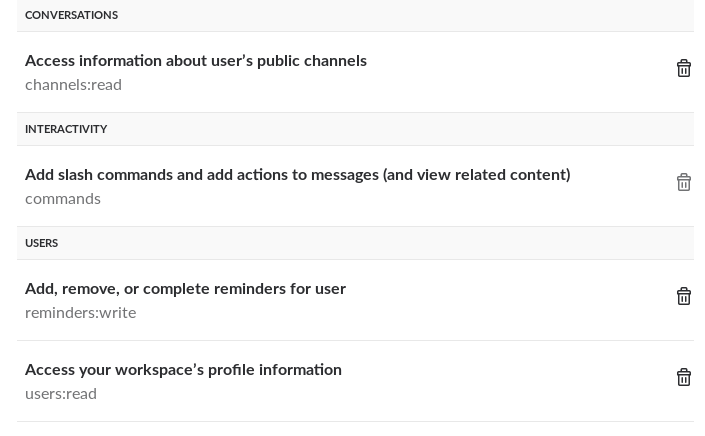

# Slack Remind All

set a reminder for all users in a channel directly using a single command

*[A placeholder for a list of cool badges, coming soonish]*

### Motivation

**T**he good old `/remind` slash command that comes by default with slack, doesnt handle channels' reminders in the way it is
super useful normally. When you need to actually broadcast a message to everyone, making sure they will be prompted directly 
at some point, falls short, by only showing a dull message **no one** will pay attention to.

**I**t's the place the custom app comes to the rescue, making it possible to issue a channel-wide `/remindall` command,
with virtually the same syntax as the original one, that then registers **direct reminders** to everyone participating in 
the channel. Except for bots - those poor things can't yet have reminders registered for themselves `(as of Dec 2018)`  

**T**ake an update of a software you just compiled for your team. Gotta spread the word now!

**U**sually, and this is proven by years of practice, it takes 3 prompts minimum for a developer to acknowledge anything that isn't a new version
of their favourite programming language, or a game update on Steam. So imagine how many hours of your life this single 
tool will spare in the long run

`Disclaimerinho: Me being a dev myself`

=== All feedback & PRs highly appreciated === 
## Requirements

* python 3.6+
* (optional) ngrok

## Installation

* clone the repo `git clone https://github.com/grzegorznowak/slack-remind-all.git`
* setup virtualenv: `virtualenv pyenv -p python3.6`
* activate venv: `. pyenv/bin/activate`
* `pip install -f requirements.txt`

### Running on dev

* (when behind a proxy) start your `ngrok` instance first
```
ngrok http 3000
```
* start the flask server
```
SLACK_SIGNING_SECRET={{ slack_remind_all_secret }} \
SLACK_OAUTH_TOKEN={{ slack_remind_all_oauth }} \
python {{ slack_remind_all_location }}/slack_remind_all/server.py
```

by default the app listens on `port 3000`, and it's currently fixed, but you can change that with a pinch of python.


## Provisioning on a server/container
see [Provisioning instructions](provision/README.md)

please note: provisioned service is exposed via http on a container's port, so need a SSL terminating proxy to function best
  
  
### Slack

#### Sample output from the app (with one user and one bot in the channel) 


#### Crucial Slack App config:

* make sure to add the slash command 


* configure the touching points


* and add the required scopes


##### make sure to put in your app endpoint's URL in the config with the slash handler URI specified 
ie. `https://example.com:3000/slack/slash` 
  
### @TODO:

* proper CI, test-coverage for the python part, shiny badges, etc. We all love those!
* **standalone** cross-workspace app on own server **(but only if folks actually need it!)**


## Sponsored by

##### [Kwiziq.com](https://www.kwiziq.com) - The AI language education platform
##### [Spottmedia.com](http://www.spottmedia.com) - Technology design, delivery and consulting


#### Author Information

Built with love using python, Slack & Ansible by [Grzegorz Nowak](https://www.linkedin.com/in/grzegorz-nowak-356b7360/)
